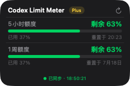
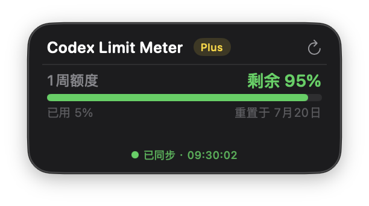
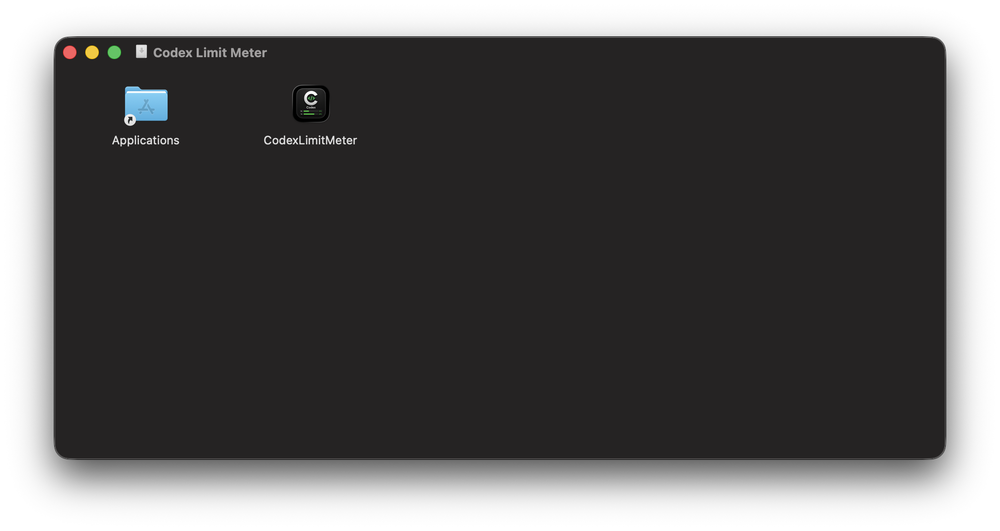
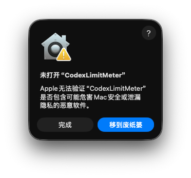

# Codex Limit Meter

[中文](README.md) | [English](README_EN.md)

> Mac 桌面 Codex 额度悬浮窗 — 实时监控当前账号可用的额度窗口
>
> A macOS desktop widget for monitoring the Codex rate-limit windows currently available to your account.

一个常驻 Mac 桌面的悬浮窗，自动获取 Codex 官方配额数据，支持拖拽、颜色预警、套餐显示。应用会按照服务端实际返回的窗口时长识别短期和周额度；如果官方临时取消某个额度窗口，对应额度行会自动隐藏，不会把周额度误显示为“168 小时额度”。



仅展示周额度时：



## 系统要求

- macOS 13.0+（Ventura 及以上）
- 已安装 Codex CLI 并完成登录（`codex` 命令可用）
- Codex 使用 ChatGPT 账号登录（非 API Key 登录）

## 下载使用

### 方式一：下载 DMG 安装（推荐）

1. 前往 [Releases](../../releases) 下载最新的 `CodexLimitMeter.dmg`
2. 请将 `CodexLimitMeter` 图标拖到左侧 `Applications` 文件夹：

   

3. 打开 Finder 的「应用程序」文件夹，双击已安装的 `CodexLimitMeter.app`
4. 首次打开如出现下图的 Gatekeeper 拦截，点击「完成」，**不要点击「移到废纸篓」**：

   

5. 二选一解除拦截：
   - **终端命令**（推荐）：在终端执行：

     ```bash
     xattr -dr com.apple.quarantine "/Applications/CodexLimitMeter.app"
     ```

     如提示 `No such file`，说明第 2 步没有完成，请先将 App 拖到 Applications，不要对 DMG 里的 App 执行命令。
   - **系统设置**：前往 **系统设置 → 隐私与安全性** → 点击「仍要打开」

6. 命令执行完毕后，回到 Finder 的「应用程序」文件夹，再次双击 `CodexLimitMeter.app` 即可。**不需要重新安装或重新下载。**

### 方式二：从源码编译

```bash
git clone https://github.com/koi-lee/codex-limit-meter.git
cd codex-limit-meter
chmod +x build.sh
./build.sh          # 编译，产物在 dist/
open dist/CodexLimitMeter.app
```

如需打包 DMG 分发给他人：

```bash
./build.sh --dmg    # 生成 dist/CodexLimitMeter.dmg
```

## 使用方式

应用启动后：

1. Dock 和菜单栏出现应用图标
2. 深色圆角悬浮窗出现在桌面，可拖拽到任意位置
3. 启动后 2-3 秒内自动连接 Codex App Server 并获取数据
4. 底部显示 **已同步** 表示连接成功

| 操作 | 说明 |
|------|------|
| 拖拽窗口 | 点击深色背景区域拖拽到任意位置 |
| 刷新按钮 | 右上角 ↻ 立即刷新 |
| 菜单栏图标 | 显示窗口 / 刷新 / 在所有桌面显示 / 语言切换 / 退出 |
| 语言切换 | 菜单栏图标 → 切换到 English / Switch to 中文 |
| 桌面显示范围 | 菜单栏图标 → 勾选或取消「在所有桌面显示」；默认开启并自动记住选择 |
| ⌘Q | 快捷键退出 |

进度条颜色基于**剩余比例**：绿色（>40% 正常）/ 橙色（20-40% 接近上限）/ 红色（<20% 即将耗尽）。

## 常见问题

**Q：首次打开提示「无法验证开发者」？**
A：应用使用 ad-hoc 签名，非 App Store 分发。两种解决方式（任选其一，仅需一次）：
- 先将 App 从 DMG 拖到 Applications，再执行：`xattr -dr com.apple.quarantine "/Applications/CodexLimitMeter.app"`
- 或前往 系统设置 → 隐私与安全性，点击「仍要打开」

如命令提示 `No such file`，说明 App 尚未拖到 Applications。命令成功后，再从「应用程序」打开 App，无需重新安装。

**Q：悬浮窗显示「更新失败」？**
A：请检查：① `codex` 命令是否可用 ② Codex 是否已登录 ③ 是否使用 ChatGPT 账号登录（非 API Key）。

**Q：为什么没有显示 5 小时额度？**
A：这表示 Codex 服务端当前没有返回 5 小时额度窗口，例如官方针对部分套餐临时取消了该限制。应用只展示实际存在的额度窗口；如果服务端以后恢复 5 小时窗口，该行会自动重新出现，无需修改配置或重新安装。

**Q：App Server 会一直后台运行吗？**
A：悬浮窗退出时会自动终止 app-server 子进程，不会残留。

**Q：可以拖到外接显示器或其他 App 的全屏空间吗？**
A：可以。悬浮窗支持跨显示器拖动，并可显示在其他 App 的全屏空间和 Stage Manager 分组中。

**Q：切换 macOS 桌面时，如何只在一个桌面显示？**
A：点击菜单栏图标，取消勾选「在所有桌面显示」。重新勾选后，悬浮窗会恢复在所有桌面显示；该选择会在重启后保留。

---

想要修改源码、调试功能或参与贡献？请阅读 [开发指南](DEVELOPMENT.md)。
