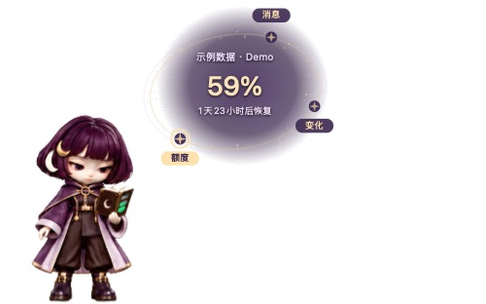
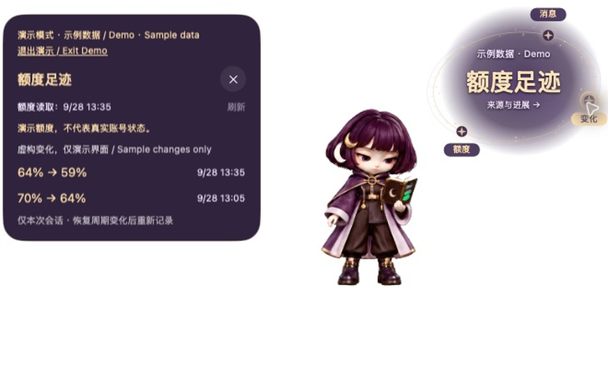

# Codex Meter

macOS 桌宠与菜单栏工具：查看 Codex 个人额度，关注公开重置消息。

[English](README_EN.md) · [额度星盘网站](https://www.starshoreai.com/quota-orbit/)

## 装到桌面后是什么样？

一个陪在桌面上的阅读小人，配合可展开的星盘，帮你看 Codex 还剩多少额度、什么时候恢复。它是独立的 macOS App。

### 看剩余额度与恢复时间



点击角色展开星盘，在「额度」「消息」「变化」之间切换；也可以从菜单栏查看额度。

### 看重置消息


展开消息详情，查看公开重置消息的进展。公开消息与个人账号额度分别展示，公告不代表自己的额度已经到账。

### 看本机额度变化



查看本次会话中的额度变化；恢复周期变化后重新记录。

> 以上为客户端演示模式的真实界面截图，额度、消息与时间均为示例数据；演示提醒不会发送系统通知。公开源码版需在本机安装并登录 Codex CLI 才能读取真实额度。

## 当前发布范围

这是新版客户端的 **AGPL-3.0 公开源码**，包含 Swift 源码、测试和本地桌宠资源。网站、服务器、浏览器扩展、开发者配置和凭据不在此仓库中。旧 Codex Limit Meter v1.1.3 及更早标签保留原 MIT 许可，已停止维护，界面与新版不同。

## Mac 公开试用版

[下载 Quota Orbit 1.3.0-beta.1（Apple 芯片）](https://github.com/koi-lee/codex-limit-meter/releases/download/v1.3.0-beta.1/Quota-Orbit-1.3.0-beta.1-arm64.dmg)

Apple 芯片 · macOS 13+｜App Store 版尚未上架。此包使用 Developer ID 签名并经 Apple 公证；这是公开试用版，仍可能存在问题。

1. 查看个人额度前，先安装并登录 Codex CLI（ChatGPT 账号）。本版不捆绑 CLI helper。
2. 打开 DMG，将 Quota Orbit 拖到 Applications，再从 Applications 启动。
3. 点击桌宠查看额度与公开消息；在 App 内主动开启通知。

已有同名 App 时先退出并保留旧安装包，再替换。公开重置公告不保证个人额度已到账。反馈时请附系统版本和问题截图，不提供账号凭据。对应源码见 `v1.3.0-beta.1` 标签；安装包校验值见同一 Release 的 SHA256SUMS.txt。


## 本地构建

需要 macOS 13+、Xcode Command Line Tools 和 Swift 5.9 或更高版本。此次在 Apple Silicon Mac 验证；Intel 尚未实机验证。

```sh
swift test --disable-sandbox
./build-local.sh
open "dist/Codex Meter Open Source.app"
```

构建脚本创建独立 Bundle ID 的本地 App，使用 ad-hoc 签名，不需要开发者证书。它不会安装或覆盖已有 App；重复构建请使用新的 `CODEX_BUILD_DIR`。公开源码版通过本机 Codex CLI 读取额度，需要自行安装并登录 Codex；不包含商店版捆绑的 CLI helper。首次打开按使用指南操作；通知由用户主动开启。

## 能做什么

- 桌宠与菜单栏展示额度、重置时间和本机额度变化。
- 星盘中查看额度与公开消息，可切换角色及演示数据。
- App 运行并联网时检查公开消息；消息来自公开源或第三方转录，需核对原帖，不能代表每个账号已到账。

账号凭据与使用数据留在本机；不上传至此仓库。额度可用性取决于 Codex 实际返回内容。无数据、失败或过期时不应视为重置完成。

## 许可

本次及后续客户端项目代码采用 GNU Affero General Public License v3.0，见 [LICENSE](LICENSE)。既有 MIT 授权仍然有效，原声明保留于 [LICENSE-MIT-legacy](LICENSE-MIT-legacy)。第三方组件保留自己的许可，见 [THIRD_PARTY_NOTICES.md](THIRD_PARTY_NOTICES.md)。项目名称与标识不表示 OpenAI 官方出品或背书。

## 验证边界

源码测试和本地构建已验证；真实通知横幅、不同系统/硬件及首次账号连接仍取决于使用环境。源码发布不替代签名、公证或商店审核。
