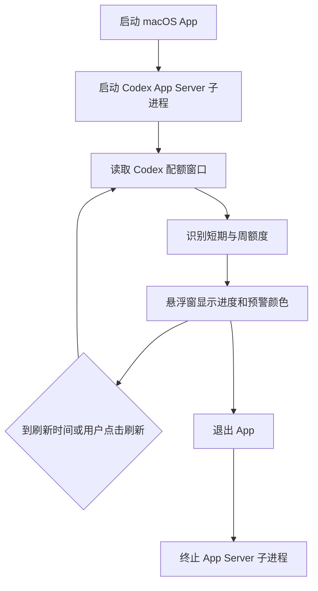
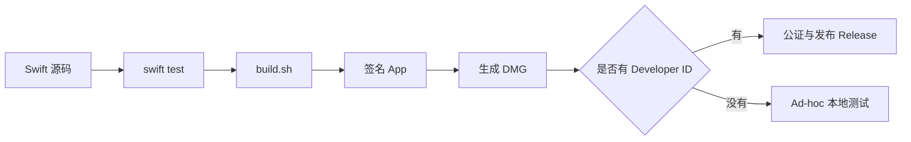

# Codex Limit Meter 项目流程图

## 运行流程

```mermaid
flowchart TD
    A[启动 macOS App] --> B[启动 Codex App Server 子进程]
    B --> C[读取 Codex 配额窗口]
    C --> D[识别短期与周额度]
    D --> E[悬浮窗显示进度和预警颜色]
    E --> F{到刷新时间或用户点击刷新}
    F --> C
    E --> G[退出 App]
    G --> H[终止 App Server 子进程]
```

## 发布流程

```mermaid
flowchart LR
    A[Swift 源码] --> B[swift test]
    B --> C[build.sh]
    C --> D[签名 App]
    D --> E[生成 DMG]
    E --> F{是否有 Developer ID}
    F -->|有| G[公证与发布 Release]
    F -->|没有| H[Ad-hoc 本地测试]
```

应用只读取本机 Codex 状态，不把认证信息写入项目或上传服务器。
